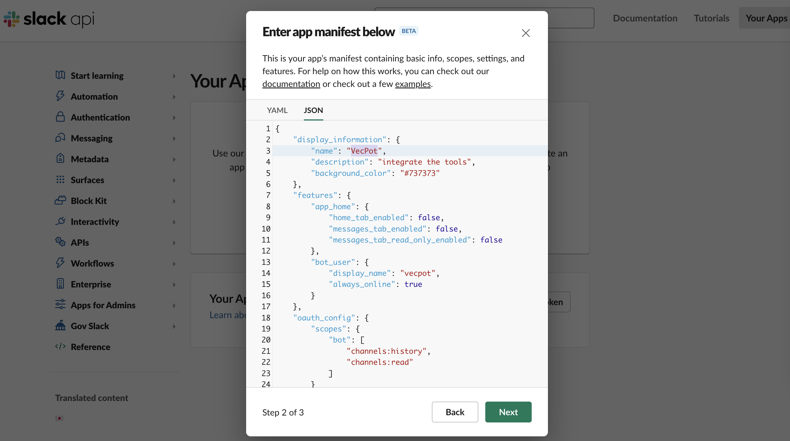
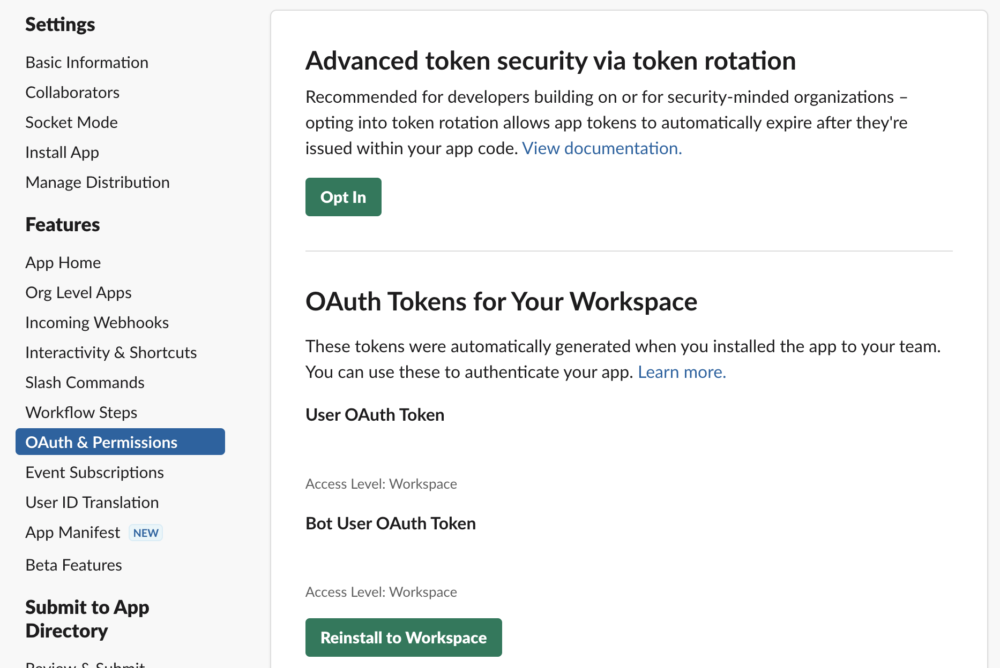

# Slack Integration

## Overview

Integrating with Slack often involves using the Slack API and creating a bot. Slack bots can respond to messages, interact with users, access the Slack API on behalf of users, and even push information from your SaaS platform to a Slack channel.

## Prerequisites

- A Slack account and a workspace where you have permissions to install apps.
- Login [vecpot](https://app.vecpot.com) and ready for integration.

## Step-by-Step Integration

### 1. Creating a New App

1. Navigate to the [Slack API](https://api.slack.com/) website.
2. Click on "Your Apps" in the top right.
3. Click on "Create New App" button.
4. Choose "From an app manifest" option.
5. Copy and paste the JSON data provided for your application configuration.

    ```json
    {
        "display_information": {
            "name": "VecPot",
            "description": "integrate the tools",
            "background_color": "#737373"
        },
        "features": {
            "app_home": {
                "home_tab_enabled": false,
                "messages_tab_enabled": false,
                "messages_tab_read_only_enabled": false
            },
            "bot_user": {
                "display_name": "vecpot",
                "always_online": true
            }
        },
        "oauth_config": {
            "scopes": {
                "bot": [
                    "channels:history",
                    "channels:read"
                ]
            }
        },
        "settings": {
            "org_deploy_enabled": false,
            "socket_mode_enabled": false,
            "token_rotation_enabled": false
        }
    }
    ```

6. Finally click on the "Create" button.

    


### 2. Retrieve Bot User OAuth Token

Post installation, go to "OAuth & Permissions" in your app settings. Under "Tokens for Your Workspace", you will see "Bot User OAuth Access Token". Copy and securely store this token; it will be used to authenticate requests from Vecpot to Slack.



